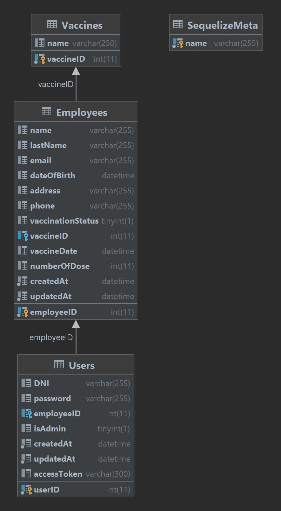

# API NODE JS+EXPRESS+SWAGGER

This is a basic server built with Node.js and Express. The server includes authentication routes and implements a simple CRUD functionality.
We don't need a connection to a local database since we are using a free online service which is very convenient for the purpose of this project.

**WARNING:**  
PLEASE USE NODE 18.13.0

## Table of Contents

- [Installation](#installation)
- [Usage](#usage)
- [Data Model](#datamodel)
- [Author](#author)

## Installation

Follow these steps to install and set up the project:

Please ensure you have nodemon installed (`npm i nodemon -g`) as it's required for development.

1. Clone the repository.
2. Run `npm i` to install dependencies.
3. Start the server:
   - Run `npm run start`
   - Alternatively, you can launch the server by opening the `app.js` file and pressing F5 if you are using Visual Studio Code.

## Usage

To use the project, follow these instructions:

The application runs on port 3000, and you can access the Swagger documentation at [http://localhost:3000/api-docs](http://localhost:3000/api-docs).

The project do the following task

- Imports necessary dependencies: express, cors, and dotenv.
- Creates an instance of the Express application.
- Enables CORS for all requests from any origin.
- Configures middleware to parse incoming requests with JSON format.
- Mounts an authentication router at the "/auth" route.
- Configures Swagger.
- Defines handlers for not-found routes and internal server errors.

## Data Model

## Author

**Fernando Murillo**  
Contact: ferchomuriem@gmail.com
